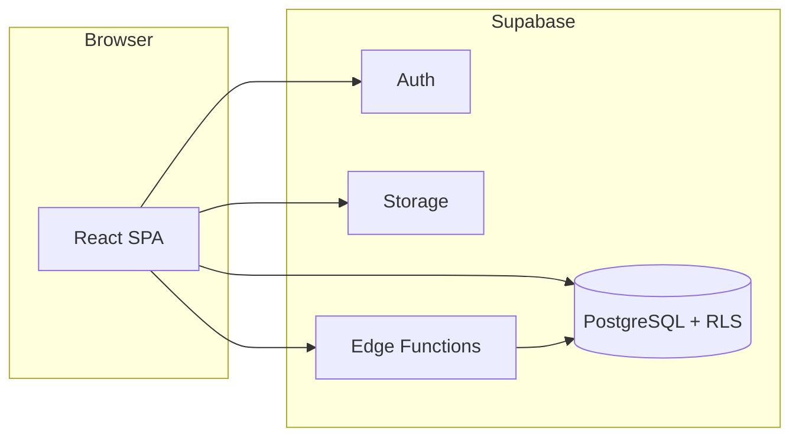

# Ricoh Capital Platform

Full-stack **asset finance / leasing** workspace for originators, administrators, and end customers. The live product UI is branded as **Zoro Capital** in configuration; product planning wireframes use the **Ricoh Capital** name.

---

## Quick links

| Resource | Description |
|----------|-------------|
| [**Interactive wireframe map**](ricoh_page_requirements.html) | 22-screen planning doc — **open this file in your browser** (clone the repo locally, then double-click or drag into Chrome/Edge/Firefox). GitHub’s file viewer does not run the embedded JavaScript. |
| [App source](ricoh-capital/) | React + Vite SPA (`ricoh-capital/`) |
| [Edge Functions guide](ricoh-capital/EDGE_FUNCTIONS.md) | Deploy and configure Supabase Edge Functions |

---

## Table of contents

- [Architecture](#architecture)
- [Features by role](#features-by-role)
- [Wireframe → routes](#wireframe--routes)
- [Getting started](#getting-started)
- [Environment variables](#environment-variables)
- [Database & Supabase](#database--supabase)
- [Project layout](#project-layout)
- [Scripts](#scripts)

---

## Architecture



- **Frontend:** React, React Router, TanStack Query, Zustand, React Hook Form + Zod, Supabase JS client, Lucide icons.
- **Backend:** Supabase (Postgres, Row Level Security, Auth, Storage) and optional **Edge Functions** for service-role operations (invites, scheduled payment status updates).

---

## Features by role

<details>
<summary><strong>Originator</strong> (approved users)</summary>

- **Onboarding:** registration, documents, verification, welcome (until admin approves).
- **Deals:** wizard (initiation → assets → review → confirmation), deal list and detail.
- **Portfolio:** dashboard, contract/asset detail, export.
- **CRM:** prospects list, profile, create/edit, qualify/convert.
- **Quotes:** list, builder, output.
- **Notifications** and **settings.**

</details>

<details>
<summary><strong>Admin</strong></summary>

- Dashboard, originator **review queue**, **deal queue**, **audit log**, **user management** (including manual payment-status refresh when cron is not used).

</details>

<details>
<summary><strong>Customer</strong> (portal)</summary>

- Portal **dashboard**, **contract detail**, **account actions**, **notifications** (invited when a deal is approved — see Edge Functions doc).

</details>

<details>
<summary><strong>Public</strong></summary>

- Login, signup, forgot password; deactivated account page.

</details>

---

## Wireframe → routes

The [page requirements HTML](ricoh_page_requirements.html) lists screens **P01–P22** plus shared patterns **S01–S03**. Below is how they map to the React app (`ricoh-capital/src/App.jsx`).

<details>
<summary><strong>P01–P05 — Rapid originator onboarding &amp; admin review</strong></summary>

| Wireframe | Route |
|-----------|--------|
| P01 Registration | `/onboarding/registration` |
| P02 Document upload | `/onboarding/documents` |
| P03 Verification | `/onboarding/verification` |
| P04 Admin review | `/admin/review` |
| P05 Welcome | `/onboarding/welcome` |

</details>

<details>
<summary><strong>P06–P09 — Quick deal capture</strong></summary>

| Wireframe | Route |
|-----------|--------|
| P06 Deal initiation | `/deals/new` |
| P07 Asset & financial details | `/deals/assets` |
| P08 Review & submit | `/deals/review` |
| P09 Confirmation | `/deals/confirmation` |

Also: `/deals` (list), `/deals/:id` (detail).

</details>

<details>
<summary><strong>P10–P13 — Portfolio</strong></summary>

| Wireframe | Route / note |
|-----------|----------------|
| P10 Portfolio dashboard | `/portfolio` |
| P11 View configurator | Column/view behaviour may live on the dashboard (check UI). |
| P12 Asset detail | `/portfolio/:id` (originator/admin); `/portal/contracts/:id` (customer) |
| P13 Export | `/portfolio/export` |

</details>

<details>
<summary><strong>P14–P17 — Self-service &amp; notifications</strong></summary>

| Wireframe | Route / note |
|-----------|----------------|
| P14 Self-service login | `/login` (shared auth) |
| P15 My dashboard | `/portal/dashboard` |
| P16 Account actions | `/portal/account` |
| P17 Notifications | `/notifications` (originator/admin); `/portal/notifications` (customer) |

</details>

<details>
<summary><strong>P18–P22 — CRM &amp; quotes</strong></summary>

| Wireframe | Route |
|-----------|--------|
| P18 Prospect list | `/crm` |
| P19 Prospect profile | `/crm/:id` |
| P20 Qualify / convert | `/crm/:id/convert` |
| P21 Quote builder | `/quotes/new` |
| P22 Quote output | `/quotes/:id` |

Prospect create/edit: `/crm/new`, `/crm/:id/edit`.

</details>

<details>
<summary><strong>S01–S03 — Shared shell &amp; UX</strong></summary>

| Wireframe | Implementation |
|-----------|----------------|
| S01 Global navigation | `AppShell`, left/top nav |
| S02 Empty / error | e.g. `NotFoundPage`, list empty states in feature pages |
| S03 Toasts / notifications | shared toast + notification pages |

</details>

**Additional admin routes:** `/admin`, `/admin/deals`, `/admin/audit`, `/admin/users`  
**Settings (all authenticated roles):** `/settings`

---

## Getting started

Prerequisites: **Node.js 18+**, **npm**, a **Supabase** project, and optionally the [Supabase CLI](https://supabase.com/docs/guides/cli) for local DB and Edge Functions.

```bash
cd ricoh-capital
cp .env.example .env
# Edit .env: set VITE_SUPABASE_URL and VITE_SUPABASE_ANON_KEY
npm install
npm run dev
```

The dev server defaults to **http://localhost:5173** (Vite). Set `VITE_APP_URL` in `.env` to match.

---

## Environment variables

Copy from [`ricoh-capital/.env.example`](ricoh-capital/.env.example):

| Variable | Purpose |
|----------|---------|
| `VITE_SUPABASE_URL` | Supabase project URL |
| `VITE_SUPABASE_ANON_KEY` | Public anon key (browser-safe) |
| `VITE_APP_NAME` | Display name (default example: Zoro Capital) |
| `VITE_APP_URL` | App base URL (e.g. production domain or `http://localhost:5173`) |

**Never** expose the service role key in `VITE_*` variables. For Edge Functions, use Supabase CLI secrets — see [`ricoh-capital/EDGE_FUNCTIONS.md`](ricoh-capital/EDGE_FUNCTIONS.md).

---

## Database & Supabase

1. Apply SQL migrations in order under [`ricoh-capital/supabase/migrations/`](ricoh-capital/supabase/migrations/) (`001` → `009`, etc.) via Supabase SQL Editor or `supabase db push` when linked.
2. Optional: enable **`pg_cron`** and follow comments in `008_payment_status_cron.sql` for daily payment-status updates (or use the admin UI manual refresh).
3. Deploy Edge Functions and set secrets as documented in **EDGE_FUNCTIONS.md**.

---

## Project layout

```
Ricoh/
├── README.md                      ← You are here
├── ricoh_page_requirements.html   ← Interactive wireframe (open in browser)
├── ricoh_capital_demo.html        ← Demo / marketing HTML (if present)
└── ricoh-capital/
    ├── src/                       ← React app (pages, hooks, auth, components)
    ├── supabase/
    │   ├── migrations/            ← Schema, RLS, seeds, cron helpers
    │   └── functions/             ← Edge Functions (TypeScript)
    ├── index.html
    ├── package.json
    ├── .env.example
    └── EDGE_FUNCTIONS.md
```

---

## Scripts

Run from `ricoh-capital/`:

| Command | Description |
|---------|-------------|
| `npm run dev` | Start Vite dev server |
| `npm run build` | Typecheck (`tsc`) and production build |
| `npm run preview` | Preview production build locally |

---

## License

Private / internal — not licensed for public distribution unless otherwise stated by the repository owner.
