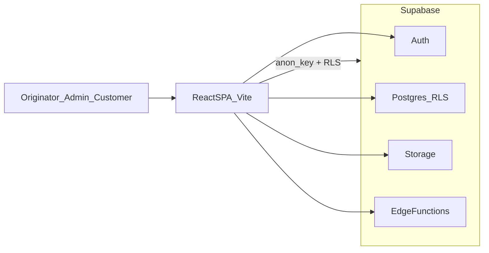
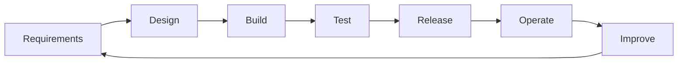

# Ricoh/Zoro Capital — One-Page Executive Summary

## What this platform is

Ricoh/Zoro Capital is a digital asset-finance platform that connects three user groups in one system:

- **Originators** submit and manage finance deals.
- **Admins** govern onboarding, approvals, risk controls, and operations.
- **Customers** self-serve contract and payment information through a portal.

The platform reduces deal turnaround time, improves compliance traceability, and provides live portfolio visibility.

## Business outcomes

- **Faster onboarding and deal processing** through guided workflows (P01–P09).
- **Better control and compliance** via role-based access, RLS, and audit logs.
- **Higher operational efficiency** through status automation (payments/contracts/quotes).
- **Improved customer experience** with portal access, notifications, and self-service.

## Scope delivered in the current implementation

- Identity and role-based access (originator/admin/customer/public).
- Originator onboarding, document handling, and admin review queue.
- Deal capture workflow, review process, and contract servicing views.
- CRM prospects and quote generation workflows.
- Notifications, auditability, and operational refresh jobs.

## Architecture at a glance

## Data architecture (executive view)

Core domains:

- **Identity**: `profiles`
- **Onboarding**: `originator_applications`, `originator_documents`, `verification_checks`
- **Deal servicing**: `deals`, `contracts`, `payment_schedule`
- **Growth pipeline**: `prospects`, `prospect_activities`, `quotes`
- **Control plane**: `notifications`, `audit_logs`

These entities enforce clear data ownership (originator/customer/admin) and policy-driven visibility.

## Security and governance

- Supabase Auth for identity.
- Row Level Security on domain tables to enforce least-privilege access.
- Service-role Edge Functions for privileged operations (user invites, bulk status updates).
- Audit logging for traceability and operational accountability.

## Lifecycle and operating model

The delivery lifecycle is iterative and supports controlled releases, post-release monitoring, and continuous improvement.

## Immediate strategic next steps

- Formalize KPI dashboard (SLA to approve, conversion rates, delinquency trends).
- Add automated test coverage for critical RLS and Edge Function paths.
- Expand integrations (credit checks, payments, eSign) where business-ready.

---

For full technical specification, see `docs/PROJECT_SPEC.md`.

