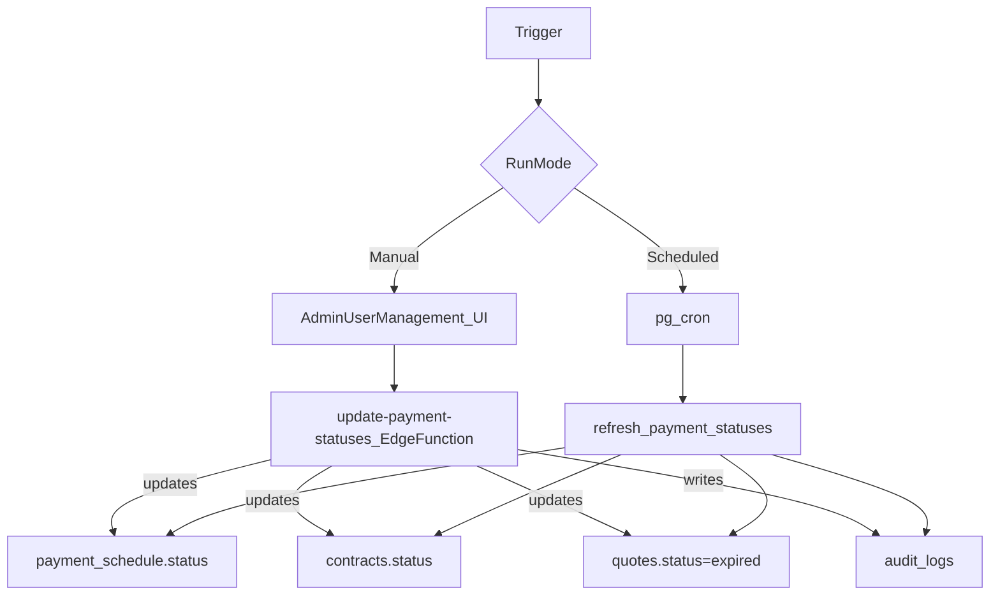
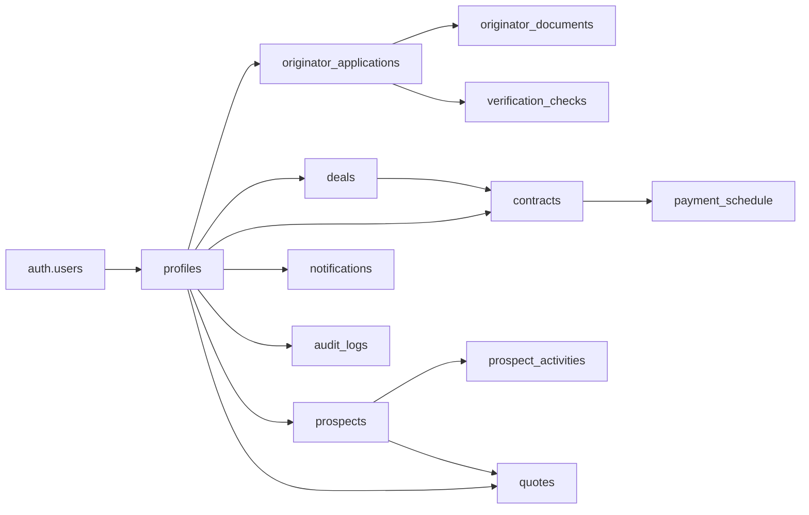

# Project Specification — Ricoh Capital

## Document control

- **Product name(s)**: Ricoh Capital (planning/wireframes), Zoro Capital (current UI branding/config)
- **Repository**: `Ricoh/` (this repo), app in `ricoh-capital/`
- **Primary stack**: React (Vite) SPA + Supabase (Auth + Postgres + RLS + Storage + Edge Functions)
- **Audience**: Business + Engineering

---

## Table of contents

- [Executive summary](#executive-summary)
- [Scope](#scope)
- [Users, roles, and permissions](#users-roles-and-permissions)
- [Feature map (screens → routes → primary data)](#feature-map-screens--routes--primary-data)
- [Functional requirements](#functional-requirements)
- [Architecture](#architecture)
- [Key workflows (end-to-end)](#key-workflows-end-to-end)
- [Data architecture](#data-architecture)
- [Lifecycle state machines (authoritative states)](#lifecycle-state-machines-authoritative-states)
- [Security model](#security-model)
- [Interfaces (Edge Functions)](#interfaces-edge-functions)
- [Non-functional requirements (NFRs)](#non-functional-requirements-nfrs)
- [Environments & deployment](#environments--deployment)
- [Application workflow (start → end)](#application-workflow-start--end)
- [Appendix](#appendix)

---

## Executive summary

Ricoh/Zoro Capital is a full-stack **asset finance / leasing workspace** for:

- **Originators**: onboard, capture deals, manage prospects/quotes, and monitor portfolio/contract performance.
- **Admins**: review/approve originators and deals, manage users/rates, and maintain auditability/operations.
- **Customers**: self-service portal to view contracts, payment schedule, and account actions.

The product is implemented as a React SPA (`ricoh-capital/`) backed by Supabase (Auth + Postgres with RLS + Storage). Privileged operations that must not be executed in the browser are implemented as Supabase **Edge Functions** (service-role).

---

## Scope

### In scope

- **Identity & access**: login/signup/forgot password; role-based routes (originator/admin/customer).
- **Originator onboarding** (P01–P05): registration, document uploads, verification status, admin review, welcome.
- **Deals** (P06–P09): create (wizard), submit, admin review/approval, contract creation and tracking.
- **Portfolio** (P10–P13): contract list/KPIs, asset detail, payment schedule, export/reporting.
- **CRM prospects** (P18–P20): prospect list/profile, activity logging, qualify/convert.
- **Quotes** (P21–P22): quote builder, scenario(s), output/share workflow; expiry handling.
- **Notifications** (P17): user notifications list + mark as read.
- **Auditability**: audit logs for system/admin actions.
- **Operations**: scheduled/manual refresh of payment + contract statuses.

### Out of scope (explicitly not implemented by this repo today)

- **External credit bureau integrations** (verification checks are modeled but not connected to external providers here).
- **Payments processing / direct debit collection** (payment schedule exists; no payment gateway integration is present).
- **Full eSign integration** (wireframes mention eSign; no provider integration is included here).
- **Complex underwriting models** beyond basic `risk_score` and review statuses.

---

## Users, roles, and permissions

### Roles

- **Public**: unauthenticated user (can access auth pages only).
- **Originator**: creates onboarding application, then (after approval) can create deals, manage prospects/quotes, see portfolio.
- **Admin**: reviews originators/deals, manages users/rates, runs operational tasks, views audit logs.
- **Customer**: end-client portal user linked to a contract; can view own contracts and payment schedule.

### “Approved originator” gate

In the UI routing layer, originator functionality is additionally gated by an “approved” requirement (`requireApproved`). Onboarding pages remain accessible to originators who are not yet approved.

Source of truth:
- Route gating: `ricoh-capital/src/App.jsx`
- Approval state: `profiles.onboarding_status` synchronized from `originator_applications.status` (DB trigger).

---

## Feature map (screens → routes → primary data)

This project uses screen IDs P01–P22 and S01–S03.

### Onboarding (P01–P05)

- **P01 Registration**: `/onboarding/registration` → `originator_applications`, `profiles`
- **P02 Document upload**: `/onboarding/documents` → `originator_documents` (+ Supabase Storage bucket `documents`)
- **P03 Verification**: `/onboarding/verification` → `verification_checks`
- **P04 Admin review**: `/admin/review` → `originator_applications`, `originator_documents`, `audit_logs`
- **P05 Welcome**: `/onboarding/welcome` → `profiles.onboarding_status=approved`

### Deals (P06–P09 + lists)

- **P06 Deal initiation**: `/deals/new` → `deals (draft)`
- **P07 Asset & financial details**: `/deals/assets` → `deals` fields
- **P08 Review & submit**: `/deals/review` → `deals.status=submitted`
- **P09 Confirmation**: `/deals/confirmation` → `deals.reference_number` generated by DB trigger
- **My deals**: `/deals` → `deals`
- **Deal detail**: `/deals/:id` → `deals`, `contracts` (when created)

### Portfolio (P10–P13)

- **P10 Portfolio dashboard**: `/portfolio` → `contracts`
- **P12 Asset/contract detail**: `/portfolio/:id` (originator/admin) and `/portal/contracts/:id` (customer) → `contracts`, `payment_schedule`
- **P13 Export**: `/portfolio/export` → `contracts` (+ client-side export)

### CRM prospects (P18–P20)

- **P18 Prospect list**: `/crm` → `prospects`
- **P19 Prospect profile**: `/crm/:id` → `prospects`, `prospect_activities`
- **Prospect create/edit**: `/crm/new`, `/crm/:id/edit` → `prospects`
- **P20 Qualify/convert**: `/crm/:id/convert` → `prospects.pipeline_stage`, `prospects.qualification_score`, activity log

### Quotes (P21–P22 + list)

- **Quotes list**: `/quotes` → `quotes`
- **P21 Quote builder**: `/quotes/new` → `quotes (draft)` including `scenarios` JSON
- **P22 Quote output**: `/quotes/:id` → `quotes.status`, output/share flow
- **Quote reference**: `quotes.reference_number` + `valid_until` generated by DB trigger

### Notifications (P17)

- **Originator/admin notifications**: `/notifications` → `notifications`
- **Customer notifications**: `/portal/notifications` → `notifications`

### Admin operations

- **Admin dashboard**: `/admin`
- **Deal queue**: `/admin/deals`
- **Audit log**: `/admin/audit` → `audit_logs`
- **User management**: `/admin/users` (also hosts manual “refresh payment statuses” per `EDGE_FUNCTIONS.md`)
- **Rates**: `/admin/rates` (UI present; pricing model details are product-defined)

---

## Functional requirements

This section describes the expected behavior at a product level (what users can do), aligned to what is already modeled in the database and routes.

### FR-01 Authentication and account access

- **FR-01.1**: Users can sign up and sign in via Supabase Auth.
- **FR-01.2**: Users can request a password reset (“forgot password”).
- **FR-01.3**: After sign-in, users are routed to pages allowed by their role (`originator | admin | customer`).

### FR-02 Originator onboarding (P01–P05)

- **FR-02.1**: Originator can create/update an onboarding application while status is `draft` or `info_requested`.
- **FR-02.2**: Originator can upload onboarding documents and see upload/validation status.
- **FR-02.3**: Admin can review applications and decide: `approved | rejected | info_requested`.
- **FR-02.4**: Approval state is reflected in the originator’s ability to access the main app (portfolio/deals/CRM/quotes).

### FR-03 Deals (P06–P09)

- **FR-03.1**: Originator can create a deal as a draft and progressively add details.
- **FR-03.2**: Originator can submit a deal for review.
- **FR-03.3**: Admin can view submitted deals and make an approval decision.
- **FR-03.4**: When a deal is approved, a contract can be created and becomes visible in portfolio.

### FR-04 Portfolio servicing (P10–P13)

- **FR-04.1**: Originator/admin can view contracts they are allowed to see, including status and next payment.
- **FR-04.2**: Customer can view only their contracts and corresponding payment schedule.
- **FR-04.3**: Users can export portfolio data (format TBD by product; CSV is a typical baseline).

### FR-05 CRM (P18–P20)

- **FR-05.1**: Originator can create/edit prospects, assign pipeline stage, and record notes.
- **FR-05.2**: Originator can record prospect activities (call/email/note/stage change/quote).

### FR-06 Quotes (P21–P22)

- **FR-06.1**: Originator can create a quote with one or more scenarios (stored in `quotes.scenarios` JSON).
- **FR-06.2**: Quotes have a reference number and a validity date; quotes become `expired` after validity.
- **FR-06.3**: Quote output is shareable (exact delivery mechanism is product-defined; repo includes core data model).

### FR-07 Notifications (P17)

- **FR-07.1**: Users can view their notifications.
- **FR-07.2**: Users can mark notifications as read.
- **FR-07.3**: The system can create notifications for key events (e.g., contract activation).

### FR-08 Audit logs

- **FR-08.1**: Admin/system status changes should be recorded in `audit_logs` with `entity_type`, `action`, and details payload.

---

## Architecture

### System context (high level)

```mermaid
flowchart LR
  originator[OriginatorUser] --> browser[WebBrowser]
  admin[AdminUser] --> browser
  customer[CustomerUser] --> browser

  browser --> spa[ReactSPA]

  spa -->|SupabaseJS(anon_key)| supabase[Supabase]

  subgraph supabase [SupabasePlatform]
    auth[Auth]
    db[Postgres_RLS]
    storage[Storage]
    functions[EdgeFunctions]
  end

  spa -->|read/write(RLS)| db
  spa -->|sign-in| auth
  spa -->|upload/download(RLS)| storage
  spa -->|invoke| functions
```

### Container diagram (runtime components)

```mermaid
flowchart TB
  subgraph client [Client]
    spa[ReactSPA_Vite]
    router[ReactRouter]
    rq[TanStackQuery]
    zustand[ZustandStore]
    forms[ReactHookForm_Zod]
    spa --> router
    spa --> rq
    spa --> zustand
    spa --> forms
  end

  subgraph hosting [Hosting]
    vercel[Vercel_StaticHosting]
  end

  vercel --> spa

  subgraph supabase [Supabase]
    auth[Auth]
    db[Postgres_with_RLS]
    storage[StorageBuckets]
    edge[EdgeFunctions_ServiceRole]
  end

  spa -->|supabase-js| auth
  spa -->|supabase-js| db
  spa -->|supabase-js| storage
  spa -->|fetch(invoke)| edge
```

---

## Key workflows (end-to-end)

### Workflow 1: Originator onboarding + admin review

```mermaid
flowchart TD
  originator[Originator] --> p01[P01_Registration]
  p01 --> appDraft[originator_applications(status=draft)]
  originator --> p02[P02_DocumentUpload]
  p02 --> docs[originator_documents(status=uploaded)]
  originator --> submit[SubmitForReview]
  submit --> appSubmitted[originator_applications(status=submitted)]

  admin[Admin] --> p04[P04_AdminReview]
  p04 -->|approve| appApproved[originator_applications(status=approved)]
  p04 -->|reject| appRejected[originator_applications(status=rejected)]
  p04 -->|request_info| appInfoRequested[originator_applications(status=info_requested)]

  appApproved --> profileApproved[profiles.onboarding_status=approved]
  appInfoRequested --> profileInfoRequested[profiles.onboarding_status=info_requested]
  appRejected --> profileRejected[profiles.onboarding_status=rejected]
```

Notes:
- `profiles.onboarding_status` is synchronized from `originator_applications.status` via DB trigger (`sync_onboarding_status`).
- Verification checks are modeled (`verification_checks`) and can be surfaced on P03.

### Workflow 2: Deal creation → approval → contract + customer invitation

```mermaid
flowchart TD
  originator[Originator] --> dealWizard[P06_P07_P08]
  dealWizard --> dealDraft[deals(status=draft)]
  dealWizard --> dealSubmit[deals(status=submitted)]

  admin[Admin] --> adminQueue[AdminDealQueue]
  adminQueue -->|approve| contractCreate[CreateContract]
  contractCreate --> contract[contracts(status=active)]
  contractCreate --> schedule[payment_schedule(rows)]

  adminQueue -->|optional| inviteCustomer[Invoke_invite-customer]
  inviteCustomer --> authInvite[SupabaseAuth_inviteUserByEmail]
  authInvite --> profileCustomer[profiles(role=customer)]
  inviteCustomer --> linkContract[contracts.customer_id_set]
  inviteCustomer --> notify[notifications(type=contract_update)]

  customer[Customer] --> setPassword[EmailLink_SetPassword]
  setPassword --> portal[PortalDashboard]
  portal --> viewContract[ViewContract_and_PaymentSchedule]
```

Notes:
- The customer invite is implemented by Edge Function `invite-customer` and requires a service role key; it verifies the caller is an authenticated admin.

### Workflow 3: Payment/contract status refresh (scheduled or manual)



Notes:
- The repo contains both a **SQL function approach** (`refresh_payment_statuses()` + optional `pg_cron`) and an **Edge Function approach** (`update-payment-statuses`). Either can be used; many teams start with manual admin-triggered runs and later add cron.

---

## Data architecture

### Core entities (tables)

Identity and access:
- `profiles` (one per auth user; contains role + onboarding status)

Onboarding:
- `originator_applications`
- `originator_documents`
- `verification_checks`

Deals and servicing:
- `deals`
- `contracts`
- `payment_schedule`

CRM and quoting:
- `prospects`
- `prospect_activities`
- `quotes` (with `scenarios` JSON)

System:
- `notifications`
- `audit_logs`

### Entity-to-table mapping (business view)

| Business entity | Purpose | Primary table(s) | Key ownership/links |
|---|---|---|---|
| User profile | Role + identity metadata for authorization/UI | `profiles` | `profiles.id = auth.users.id` |
| Originator onboarding case | KYC/application record and review status | `originator_applications` | `user_id -> profiles.id` |
| Onboarding document | Evidence files + validation status | `originator_documents` | `application_id -> originator_applications.id` |
| Verification check | Automated/manual compliance checks | `verification_checks` | `application_id -> originator_applications.id` |
| Deal | Originator-submitted finance request | `deals` | `originator_id -> profiles.id` |
| Contract | Approved deal converted to active finance agreement | `contracts` | `deal_id -> deals.id`, `originator_id -> profiles.id`, `customer_id -> profiles.id` |
| Installment/payment line | Due schedule for each contract | `payment_schedule` | `contract_id -> contracts.id` |
| Prospect | CRM lead/opportunity record | `prospects` | `originator_id -> profiles.id`, `assigned_to -> profiles.id` |
| Prospect activity | Timeline/action log for CRM | `prospect_activities` | `prospect_id -> prospects.id`, `created_by -> profiles.id` |
| Quote | Offer/scenario proposal | `quotes` | `originator_id -> profiles.id`, `prospect_id -> prospects.id` |
| Notification | In-app user notification | `notifications` | `user_id -> profiles.id` |
| Audit event | Traceability for system/admin actions | `audit_logs` | `performed_by -> profiles.id` |

### Canonical ownership fields (for RLS and tenancy)

- **User-owned**: `profiles.id`
- **Originator-owned**: `originator_applications.user_id`, `deals.originator_id`, `prospects.originator_id`, `quotes.originator_id`
- **Customer-owned**: `contracts.customer_id`
- **Shared but constrained**: `payment_schedule` via owning `contracts` row
- **Admin/system managed**: `audit_logs`, privileged updates through Edge Functions

### Logical relationship diagram



### Key invariants and automation

- **Profile creation**: on auth signup, `profiles` row is created automatically (trigger `handle_new_user`).
- **Reference numbers**:
  - Deals: `ZC-YYYY-#####` assigned on insert if missing (trigger `generate_deal_reference`).
  - Quotes: `QT-YYYY-####` assigned on insert if missing, and `valid_until` defaults to +30 days (trigger `generate_quote_reference`).
- **Onboarding status synchronization**: updates to `originator_applications.status` update `profiles.onboarding_status`.

---

## Lifecycle state machines (authoritative states)

### Originator onboarding

Tables/fields:
- `originator_applications.status`: `draft | submitted | under_review | info_requested | approved | rejected`
- `profiles.onboarding_status`: `pending | submitted | under_review | info_requested | approved | rejected`

Lifecycle:
- Originator can update application while `draft` or `info_requested`.
- Admin can update any application status; change is reflected onto the profile via trigger.

### Deals

`deals.status`: `draft | submitted | under_review | approved | rejected`

Typical transitions:
- `draft → submitted` (originator submits)
- `submitted → under_review` (admin picks up / triage)
- `under_review → approved | rejected` (admin decision)

### Contracts and payment schedule

`contracts.status`: `active | overdue | maturing | completed | cancelled`  
`payment_schedule.status`: `upcoming | due_soon | paid | overdue`

Refresh logic (implemented in SQL function and Edge Function):
- `upcoming → due_soon` when due in ≤7 days
- `upcoming/due_soon → overdue` when past due date
- `contracts.active/maturing → overdue` if any overdue payment exists
- `contracts.active → maturing` if end date within 90 days
- `contracts.active/maturing → completed` if end date in past and no overdue payments

### Quotes

`quotes.status`: `draft | sent | accepted | rejected | expired`

Automatic transition:
- `draft/sent → expired` when `valid_until < today` (via refresh job)

---

## Security model

### Authentication

- Supabase Auth is the identity provider.
- User attributes (role, name, company) are stored in `profiles` for authorization and UI gating.

### Authorization (RLS)

Row Level Security is enabled across all domain tables, with policies that:
- Allow users to read/write their own data (originator-owned deals/prospects/quotes, customer-owned contracts).
- Grant admins broad read/write access.

Policy patterns (examples):
- `deals`: originators can manage their own; admins can view all.
- `contracts`: originators can view contracts they originated; customers can view their own; admins can manage all.
- `notifications`: users can view/update their own; system can insert.

Source of truth: `ricoh-capital/supabase/migrations/002_rls.sql`.

### Storage access model (documents/contracts)

The schema indicates two private buckets are intended:

- `documents` (originator onboarding uploads)
- `contracts` (generated/issued contract docs, if/when added)

RLS policies for Storage are provided as a template in `002_rls.sql` (commented) and should be enabled after buckets are created. The recommended convention is:

- Store objects under a first-level “folder” equal to the uploader’s `auth.uid()` (e.g., `documents/<userId>/<file>`), enabling simple folder-based checks.

### Service-role boundary (Edge Functions)

Operations that must not be possible from the browser (even with RLS) are performed by Edge Functions using the Supabase **service role key**, including:
- Inviting customers/admins (`invite-customer`, `invite-admin`)
- Bulk status updates (`update-payment-statuses`)

All Edge Functions should:
- Enforce CORS
- Verify caller identity
- Verify caller is admin (as implemented in `invite-customer` / `invite-admin`)

### Secrets management

- Browser-safe keys only in `VITE_*` env vars (anon key, URL).
- Service role key only as Supabase Edge Function secret: `SUPABASE_SERVICE_ROLE_KEY`.

---

## Interfaces (Edge Functions)

Edge Functions are the service-role boundary. They must verify caller identity and that caller is an admin before performing privileged work.

### `invite-customer`

- **Purpose**: invite or link a customer user to a contract and notify them.
- **Auth**: requires `Authorization: Bearer <JWT>` of an authenticated admin; function verifies admin role from `profiles`.
- **Secrets**: `SUPABASE_SERVICE_ROLE_KEY`, `SITE_URL`
- **Input (JSON)**:
  - `email` (string, required)
  - `customerName` (string, optional but recommended)
  - `contractId` (string/uuid, required)
  - `dealId` (string/uuid, optional)
- **Output (JSON)**: `{ success: true, customerId, isExisting }` on success; otherwise `{ error }`

Source: `ricoh-capital/supabase/functions/invite-customer/index.ts`

### `invite-admin`

- **Purpose**: invite an admin user, set role to `admin`, and mark onboarding approved.
- **Auth**: requires `Authorization: Bearer <JWT>` of an authenticated admin; function verifies admin role.
- **Secrets**: `SUPABASE_SERVICE_ROLE_KEY`, `SITE_URL`
- **Input (JSON)**: `{ email, fullName }`
- **Output (JSON)**: `{ success: true, userId }` or `{ error }`

Source: `ricoh-capital/supabase/functions/invite-admin/index.ts`

### `update-payment-statuses`

- **Purpose**: bulk update `payment_schedule`, `contracts`, and `quotes` (expiry) and write an audit entry.
- **Auth**: service-role; recommended to restrict invocation to admins only (implementation currently assumes service-role execution).
- **Output (JSON)**: `{ success: true, results }`

Source: `ricoh-capital/supabase/functions/update-payment-statuses/index.ts`

---

## Non-functional requirements (NFRs)

### Availability and reliability

- Target SPA availability aligned with hosting (Vercel) and Supabase SLA.
- Degraded-mode support: if scheduled refresh is disabled, admins can still run manual refresh.

### Performance

- Use TanStack Query caching for standard list/detail flows.
- Prefer server-side filtering/pagination for large tables (portfolio, deals, prospects) where needed.

### Auditability and compliance

- Admin/system actions that change status should write audit log entries (`audit_logs`).
- Onboarding and deal decisions should capture `reviewed_by`, `reviewed_at`, and reason fields where applicable.

### Observability

- Edge Functions should return structured JSON and log errors to function logs.
- Add admin-facing failure surfaces for invite/status refresh operations (UX requirement).

---

## Environments & deployment

### Local development

- `npm run dev` from `ricoh-capital/` (Vite default `http://localhost:5173`).
- `.env` is based on `.env.example` with `VITE_SUPABASE_URL` and `VITE_SUPABASE_ANON_KEY`.

### Production deployment

- SPA hosted on Vercel; `vercel.json` rewrites all paths to `/index.html` to support client-side routing.
- Supabase hosts database/auth/storage and Edge Functions.

### Edge Functions deployment

Per `ricoh-capital/EDGE_FUNCTIONS.md`:
- Deploy: `npx supabase functions deploy <name>`
- Secrets: `SUPABASE_SERVICE_ROLE_KEY`, `SITE_URL`
- Optional scheduling: enable `pg_cron` and schedule `refresh_payment_statuses()` (see `008_payment_status_cron.sql`)

---

## Application workflow (start → end)

This section describes the actual in-app journey: where users start, what comes next, and the key handoffs between roles.

### 1) Entry and authentication

1. User opens the app URL.
2. Public user accesses:
   - `/login` (default)
   - `/signup`
   - `/forgot-password`
3. After successful authentication, the app loads `profiles.role` and routes the user into the correct experience:
   - **Originator**: onboarding (if not approved) or main originator app (if approved)
   - **Admin**: admin operations (`/admin/*`)
   - **Customer**: customer portal (`/portal/*`)

### 2) Originator onboarding (first-time originator)

1. Originator completes registration at **P01** `/onboarding/registration`.
2. Uploads KYC/compliance documents at **P02** `/onboarding/documents`.
3. Tracks verification status at **P03** `/onboarding/verification`.
4. Submits onboarding for review (application status transitions to `submitted`).
5. Admin reviews in **P04** `/admin/review` and chooses one outcome:
   - **Approve** → originator becomes approved (`profiles.onboarding_status=approved`)
   - **Request info** → originator must update/resubmit
   - **Reject** → onboarding ends unless reopened by policy
6. If approved, originator sees **P05** `/onboarding/welcome` and is allowed into main originator routes (those with `requireApproved`).

### 3) Deal capture and submission (originator)

1. Originator starts a deal at **P06** `/deals/new` (creates a `deals` draft).
2. Enters asset/finance details at **P07** `/deals/assets`.
3. Reviews and submits at **P08** `/deals/review` (deal status transitions to `submitted`).
4. Gets a reference number and confirmation at **P09** `/deals/confirmation`.
5. Originator can monitor:
   - `/deals` (list)
   - `/deals/:id` (detail)

### 4) Deal review, approval, and contract activation (admin)

1. Admin reviews deals in `/admin/deals` (deal queue).
2. Admin decides:
   - **Approve** → contract is created (and becomes visible in portfolio views)
   - **Reject** → deal is rejected and remains visible to the originator
3. Admin can initiate a **customer portal invitation** if a client email is available.

### 5) Customer invitation and portal activation (admin → system → customer)

1. Admin invokes **`invite-customer`** (service-role Edge Function).
2. System behavior:
   - If the email is new: sends an invite email (set-password flow).
   - If the email exists: links that existing profile to the contract.
3. Contract is linked by setting `contracts.customer_id`.
4. Customer logs in and lands on `/portal/dashboard`.
5. Customer self-serves:
   - `/portal/contracts/:id` (contract + payment schedule)
   - `/portal/account`
   - `/portal/notifications`

### 6) Portfolio servicing and operational refresh (ongoing)

1. Originator/admin uses `/portfolio` to monitor contracts and KPIs.
2. Detail views show payment schedules and status indicators.
3. Statuses are refreshed either:
   - **Scheduled**: `pg_cron` executes `refresh_payment_statuses()` (recommended for production), or
   - **Manual**: admin triggers a refresh via the Edge Function `update-payment-statuses`.
4. System writes an audit entry for refresh runs and can produce notifications for key events.

### 7) CRM and quotes (parallel workflow)

1. Originator manages prospects at `/crm` and `/crm/:id`.
2. Originator logs activities (calls/emails/notes/stage changes) to build a timeline.
3. Originator creates quotes at `/quotes/new` and shares/prints output at `/quotes/:id`.
4. Quotes expire automatically when `valid_until` is in the past.

### 8) End state (continuous operation)

- Originators continuously create deals, manage prospects/quotes, and monitor portfolio performance.
- Admins continuously govern onboarding/deals, user access, and operational controls.
- Customers continuously self-serve contracts and account actions.

---

## Appendix

### Primary references in this repo

- Product scope + interactive wireframe mapping: `README.md`
- Routes and role gating: `ricoh-capital/src/App.jsx`
- Database schema + triggers: `ricoh-capital/supabase/migrations/001_schema.sql`
- Row Level Security policies: `ricoh-capital/supabase/migrations/002_rls.sql`
- Payment refresh + cron scheduling: `ricoh-capital/supabase/migrations/008_payment_status_cron.sql`
- Edge Functions deployment & behavior: `ricoh-capital/EDGE_FUNCTIONS.md`

